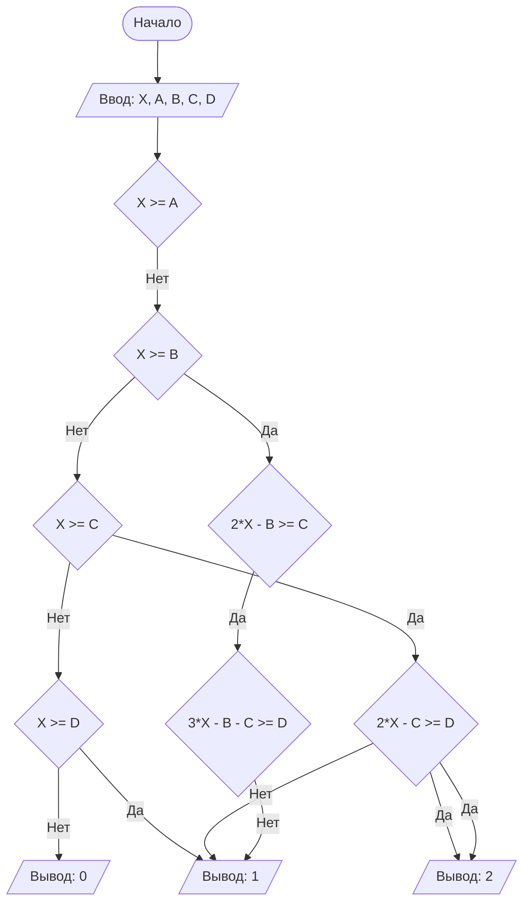

## Отчет по лабораторной работе № 1

#### № группы: `ПМ-2502`

#### Выполнил: `Нестерчук Виктория Юрьевна`

#### Вариант: `12`

### Cодержание:

- [Постановка задачи](#1-постановка-задачи)
- [Входные и выходные данные](#2-входные-и-выходные-данные)
- [Выбор структуры данных](#3-выбор-структуры-данных)
- [Алгоритм](#4-алгоритм)
- [Программа](#5-программа)
- [Анализ правильности решения](#6-анализ-правильности-решения)

### 1. Постановка задачи

> Программа получает на вход 2 числа X,A,B,C,D. Последовательность из четырех ванночек объемами A, B, C, D литров уста-
новлена в указанном порядке ступенькой (объем A — сверху). Ванночки
установлены таким образом, что если в ванночку наливать воду больше её
объема, излишки будут стекать в следующую ванночку, установленную ни-
же (как каскадный водопад). Изначально все ванночки пусты. В каждую
ванночку выливают воду объемом X литров. Какое количество ванночек
окажется в результате полностью заполненным?

### 2. Входные и выходные данные

#### Данные на вход

На вход программа должна получать 5 натуральных числа.

|             | Тип                | 
|-------------|--------------------|
| X (Число 1) | Натуральное число  | 
| A (Число 2) | Натуральное число  |
| B (Число 3) | Натуральное число  |
| C (Число 4) | Натуральное число  |
| D (Число 5) | Натуральное число  |

#### Данные на выход

Т.к. программа должна вывести количество заполненных ванночек, то на выход мы получим
единственное целое неотрицательное число, от 0 до 4.

|         | Тип                                | min значение | max значение   |
|---------|------------------------------------|--------------|----------------|
| Число 1 | целое неотрицательное число        | 0            | 4              |

### 3. Выбор структуры данных

Программа получает 5 натуральных числа. Поэтому для их хранения
можно выделить 5 переменных (`X`,`A`,`B`,`C`,`D`) типа `int`.

|             | название переменной | Тип (в Java) | 
|-------------|---------------------|--------------|
| X (Число 1) | `X`                 | `int`        |
| A (Число 2) | `A`                 | `int`        |
| B (Число 3) | `B`                 | `int`        |
| C (Число 4) | `C`                 | `int`        |
| D (Число 5) | `D`                 | `int`        |

Для вывода результата необязательно его хранить в отдельной переменной.

### 4. Алгоритм

#### Алгоритм выполнения программы:

1. **Ввод данных:**  
   Программа считывает пять натуральных чисел, обозначенные как `X`,`A`,`B`,`C`,`D`.

2. **Сравнение чисел:**  

#### Блок-схема

